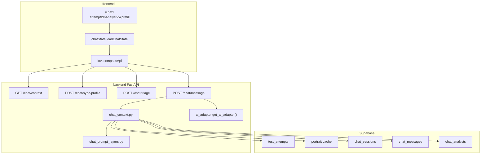

# LoveCompass AI Chat — 架构与逻辑说明

> 用途：给外部 AI / 顾问做优化评审。仓库路径：`lovecompass-sync/docs/AI_CHAT_ARCHITECTURE.md`  
> 更新基准：main @ Phase 1 顾问体系 + Phase 2 ROS 接 API（2026-05）

---

## 0. 产品边界

```text
┌─────────────────────────────────────────────────────────────────┐
│ LoveCompass AI 能力（两条线，勿混优化）                            │
├────────────────────────────┬────────────────────────────────────┤
│ A. 结果页 AI 报告           │ B. AI 关系顾问 Chat（本文档）       │
├────────────────────────────┼────────────────────────────────────┤
│ 交卷后一次性生成            │ 用户持续对话                       │
│ self/ros/mate_ai_content   │ POST /chat/message                 │
│ ai_director + json_mode    │ 单条超长 user prompt               │
│ 输出严格 JSON              │ 输出自由文本（四位人格）            │
└────────────────────────────┴────────────────────────────────────┘
```

Chat 定位：**在已完成测评画像之上做追问、陪伴、解读**（SELF / ROS / MATE），四位顾问：Oracle / Darwin / Haven / Sage。

---

## 1. 端到端数据流




---

## 2. 前端

### 2.1 路由与 Search Params

```typescript
// frontend/src/lib/chatRouteSearch.ts
type ChatRouteSearch = {
  analystId?: string;   // oracle | darwin | haven | sage（默认 sage）
  attemptId?: string;   // 绑定某次 completed attempt
  prefill?: string;       // 进入页预填输入（ROS 层问诊句式）
};
// Route: /chat
```

### 2.2 入口


| 来源                | 行为                                              |
| ----------------- | ----------------------------------------------- |
| 首页 / 历史           | `chatRouteSearch(attemptId?)`                   |
| SELF/ROS/MATE 结果页 | `attemptId` + `prefill`（触发后端 `ros_chat_layers`） |
| 侧边栏 TRIAGE        | `POST /chat/triage` → 切换顾问                      |


### 2.3 加载（不调 LLM）

```typescript
// frontend/src/lib/chatState.ts
loadChatState({ attemptId, analystId })
  → GET /chat/context
  → 无效 attemptId 时重试「不绑 attempt」
  → 有 messages[] 则还原；否则 buildCounselorGreeting() 本地文案
```

### 2.4 发送

```typescript
lovecompassApi.sendChatMessage({ attemptId, analystId, message })
  → POST /chat/message
  → 无 SSE；整段回复一次显示

lovecompassApi.syncChatProfile()
  → POST /chat/sync-profile
  → 重建 portrait + 固定 ack 话术（不调 LLM）
```

### 2.5 关键文件

```text
frontend/src/routes/chat.tsx
frontend/src/lib/chatState.ts
frontend/src/lib/counselors.ts
frontend/src/lib/chatRouteSearch.ts
frontend/src/lib/lovecompassApi.ts
```

---

## 3. 后端 API


| Method | Path                 | Auth | 说明                                               |
| ------ | -------------------- | ---- | ------------------------------------------------ |
| GET    | `/chat/context`      | JWT  | 画像摘要 + profile 快照 + sessionId + 最近 40 条消息        |
| POST   | `/chat/sync-profile` | JWT  | `rebuild_and_cache_portrait` + acknowledgment 文本 |
| POST   | `/chat/triage`       | JWT  | 关键词分诊（无 LLM）                                     |
| POST   | `/chat/message`      | JWT  | 写 user → 组 prompt → LLM → 写 assistant            |


```python
# backend/app/main.py
class ChatIn(BaseModel):
    attemptId: str | None = None
    analystId: str | None = "sage"
    message: str = Field(min_length=1)

class TriageIn(BaseModel):
    message: str = Field(min_length=1, max_length=2000)
```

---

## 4. 会话与画像绑定

### 4.1 Session 维度

```sql
-- 逻辑主键（应用层）
(user_id, analyst_id, attempt_id)  -- attempt_id 可为 NULL
-- 换顾问 = 新 session；同顾问 + 同 attempt = 续聊
```

表：`chat_sessions`, `chat_messages`, `chat_analysts`

### 4.2 Attempt 解析（聊天专用，不掐断对话）

```python
# chat_context.resolve_attempt_or_latest
# - 有 attemptId：尽量命中；无效 UUID / 404 → 回退最近一次 completed
# - 无 attemptId：最近一次 completed
# - 不抛 HTTP 404
```

### 4.3 画像注入「双层」（已知接缝）

```text
Layer A — profile_block（build_effective_profile_block）
  ├─ 有 attempt → 单套详情（suite_context.build_suite_profile_context_block）
  │     · 维度自然语言 · assembledAiContext · AI 报告摘录
  ├─ 无 attempt 但有任意套完成 → 跨套汇总块
  └─ 全无 → build_unbound_context_message()

Layer B — portrait-reader（build_portrait_reader_layer）
  ├─ profile_center.build_portrait / rebuild
  ├─ SELF / ROS / MATE 各一套 headline
  └─ crossSuiteTemplates 联动句（analysis_phrase_library_v1.json）

有 attempt 时 A+B 可能部分重复；prompt 要求「必须以真实画像为准」。
```

---

## 5. Prompt 组装（核心）

```python
# chat_context.build_chat_prompt() → 单个 str → ai_adapter.generate(prompt)

ORDER = [
  "1. analyst.system_prompt",      # MIRROR_CHAT_BASE + DB
  "2. mirror-tone",                # 词库 + FORBIDDEN_RULES + shared skill
  "3. crisis-guard",               # elevated/high 时
  "4. portrait-reader",            # 跨套摘要（已登录）
  "5. ros_inquiry_layer",          # ROS + 特定 prefill 句式
  "6. Agent Skill persona_prompt", # counselor_skills/{slug}/SKILL.md
  "7. profile_block",              # 单套或跨套
  "8. 最近 12 轮历史",              # 文本拼接「用户：… 顾问：…」
  "9. 用户当前问题",
  "10. 回答要求（禁止客服腔、裸报 SA/RK、绝对预言）",
]
```

### 5.1 顾问人格来源

```text
chat_analysts (DB slug, system_prompt, persona_prompt)
    ↓ enrich_analyst_with_skill()
backend/app/counselor_skills/{oracle|darwin|haven|sage}/SKILL.md
    ↓ fallback
backend/app/counselor_personas.PERSONAS
```

### 5.2 共用 Skill 层

```text
backend/app/shared_skills/  或  .cursor/skills/
  mirror-tone/     → build_mirror_tone_layer()
  crisis-guard/    → assess_crisis + build_crisis_guard_layer
  portrait-reader/ → build_portrait_reader_layer()
  triage/          → triage_counselor()（仅 /chat/triage API）
```

词库：`backend/data/analysis_phrase_library_v1.json`

### 5.3 ROS 结果页深探

```python
# backend/app/ros_chat_layers.build_ros_inquiry_layer(user_message, attempt)
# 触发：prefill 匹配例如
#   「我在看 ROS 报告里的「{label}」层（{code} · {score}）」
#   「我想展开了解报告里的「盲区提示」」
#   「我在看 ROS 双人报告里的层间差距」
# 效果：注入 Prompt 5 写作规范（80–120 字、承接+洞察+开放问题）
```

### 5.4 案例库（Phase 1：规则 + scene_tags）

```text
chat_case_examples (Supabase)
    ↓ infer_scene_tags(user_message)  # 与 triage 同一套标签词表
    ↓ GIN(scene_tags) + counselor_slug + product_set 预筛（最多 80 条）
    ↓ Python 打分 → 注入 1–2 条 few-shot
build_chat_messages() 顺序：
  portrait → profile → 【案例 user】→ assistant(案例锚定) → history → 当前 user
```

- 模块：`chat_case_tags.py`、`chat_case_library.py`
- 迁移：`migrations/202605260002_chat_case_examples.sql`
- 字段：`use_count`（注入时 +1）、`hit_rate`（可选，后期自动调 `priority`）
- **大规模**：数百～上千条仍走标签 + 关键词 + `priority`/`hit_rate`；跨场景误捞或维护成本过高时再 `CREATE EXTENSION vector`，做「标签过滤 → 向量 Top-K → 注入 2 条」

---

## 6. 危机护栏

```python
crisis_level = assess_crisis(message, history[-4:])  # regex

if crisis_level == "high":
    # 不调 LLM；固定回复 12356 / 400-161-9995 / 120；落库 assistant
    return { "message": build_crisis_response(), "crisis": True }

# elevated：仍走 LLM，prompt 追加 crisis-guard 层
# 响应 crisis: crisis_level != "none"
```

---

## 7. 分诊 Triage（无 LLM）

```python
# chat_prompt_layers.triage_counselor(message)
# 关键词计分 → haven | oracle | darwin | sage
# 返回：counselorId, confidence, reason, matchedSignals, alternatives
```


| slug   | 典型信号            |
| ------ | --------------- |
| haven  | 分手、崩溃、陪陪我、睡不着   |
| oracle | 信号、暧昧、他到底、值不值得追 |
| darwin | 沉没成本、止损、恋爱脑、消耗型 |
| sage   | 模式、结构、依恋、重复（默认） |


---

## 8. AI Adapter

```python
# Chat：build_chat_messages() → generate_messages / stream_messages
# 不在 adapter 层叠加报告口吻 system；人格在 messages[0].system

# 报告生成：generate(prompt) → REPORT_SYSTEM + user prompt（json_mode）

POST /chat/message { stream: true }  → text/event-stream
  data: {"meta": {...}}
  data: {"delta": "..."}
  data: {"done": true, "message": "..."}
  data: [DONE]
```

环境变量：

```bash
AI_PROVIDER=zhipu          # 默认 mock
ZHIPU_API_KEY=sk-...
ZHIPU_BASE_URL=https://open.bigmodel.cn/api/paas/v4
ZHIPU_MODEL=glm-4-flash
```

四位顾问 **共用同一 model**；`chat_analysts.model_`* 尚未接入（ROADMAP）。

---

## 9. Chat vs 结果页报告


| 维度     | Chat            | 结果页报告                                   |
| ------ | --------------- | --------------------------------------- |
| 入口     | `/chat/message` | submit 后 ai_content / ai_result_reports |
| Prompt | Skill 层叠 + 人格   | `ai_director.build_director_prompt`     |
| 输出     | 自由文本            | `json_mode=true`                        |
| 历史     | DB 12 轮文本拼接     | 无会话                                     |
| 缓存     | chat_messages   | result_payload.ai_content               |


---

## 10. 已知局限（优化清单）

```yaml
issues:
  - id: monolithic_prompt
    desc: 画像+Skill+历史全塞进一条 user message，token 膨胀
  - id: pseudo_multiturn
    desc: 非 OpenAI messages[] 多轮；历史是字符串拼接
  - id: no_streaming
    desc: 无 SSE，长回复等待差
  - id: duplicate_context
    desc: portrait-reader 与 profile_block 可能重复
  - id: single_model
    desc: 四位顾问无法 per-slug model/temperature
  - id: no_session_memory
    desc: 无 summarizer → chat_sessions.memory_summary（Phase 4 计划）
  - id: keyword_triage
    desc: 分诊纯关键词，歧义/英文弱
  - id: adapter_system_mismatch
    desc: Adapter system prompt 偏「报告引擎」，与人格 system 不一致
  - id: crisis_elevated
    desc: 仅 high 短路；elevated 仍靠 prompt 自律
```

---

## 11. 产品约束（优化时不可破坏）

```text
- 四位顾问语气必须可区分，禁止混用其他人格 Skill
- 有画像时禁止说「尚未接入数据」
- 禁止裸报 SA/RK/FS 等编号与具体分数（用 band 自然语言）
- 关系决策：给信号与思考框架，不做绝对预言
- 危机：安全优先，high 必须短路 LLM
- 不暴露 prompt、DB 字段、JSON 结构给用户
```

---

## 12. 文件索引

```text
backend/app/main.py                    # /chat/* 路由
backend/app/chat_context.py            # session、画像 bundle、build_chat_prompt
backend/app/chat_prompt_layers.py      # mirror-tone, crisis, portrait-reader, triage
backend/app/counselor_personas.py      # 四位元数据 + Skill 加载
backend/app/counselor_skills/*/SKILL.md
backend/app/shared_skills/*/SKILL.md
backend/app/ros_chat_layers.py         # ROS 问诊层
backend/app/suite_context.py           # 单套 profile_block
backend/app/profile_center.py          # portrait 缓存
backend/app/ai_adapter.py
backend/data/analysis_phrase_library_v1.json
frontend/src/routes/chat.tsx
frontend/src/lib/chatState.ts
frontend/src/lib/counselors.ts
.cursor/skills/README.md
docs/ROADMAP.md                        # Phase 1 / 4
backend/docs/AI_Adapter_设计说明.md
```

---

## 13. 给外部 AI 的 Prompt 模板（可直接粘贴）

```markdown
你是 LoveCompass MIRROR AI Chat 的架构评审员。请基于以下约束提出优化方案：

【当前架构】
- 单 endpoint POST /chat/message，prompt 为多层 Skill + 画像 + 12 轮历史拼接的一条 user 字符串
- 智谱 glm-4-flash，非流式；四位顾问共用同一 adapter
- 画像双层：单 attempt 详情 + portrait-reader 跨套摘要
- 危机 high 不调 LLM；triage 为关键词规则

【不可破坏】
- 四位人格可区分；禁止裸报维度编号；不做绝对关系预言；危机安全短路

【请输出】
1. Prompt 结构重构建议（是否改 native messages、如何裁剪 token）
2. 画像注入去重与优先级策略
3. 分诊升级路径（规则 → 轻量分类 → LLM）
4. 流式与 session memory 的接入顺序
5. 风险项与 A/B 验证指标

完整技术细节见：docs/AI_CHAT_ARCHITECTURE.md
```

