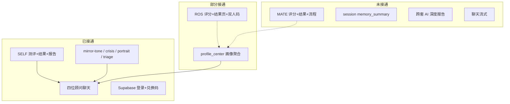

# MIRROR / LoveCompass 技术路线图

> 生成依据：现有代码库 + `roadmap` skill + `improve-codebase-architecture` 接缝分析  
> 更新：2026-05-24  
> **模式：** `plan`（执行时说「resume phase N」或「start phase N」）

---

## 愿景（One Sentence）

**MIRROR** 是一套 AI 关系画像系统：用户完成 SELF / ROS / MATE 三套测评后，获得可进化的个人档案，并由四位带 Skill 的 AI 顾问基于真实画像对话。

| 维度 | 内容 |
|------|------|
| **谁用** | 兑换码解锁的 C 端用户；后续 admin 运营 |
| **为什么** | 一次性报告不够；需要「画像 + 持续对话 + 跨套联动」 |
| **约束** | TanStack Router + Vite 前端；FastAPI + Supabase Postgres 后端；Vercel 部署；智谱/mock AI |
| **明确不做（v1）** | 原生 App、实时 CRDT 协作、多租户 SaaS 计费、第五人格顾问 |

---

## 技术栈（已锁定）

| 层 | 选型 | 说明 |
|----|------|------|
| 前端 | Vite + React + TanStack Router | Root: `frontend/` |
| 后端 | FastAPI + psycopg | Root: `backend/` |
| 数据库 | Supabase Postgres | 迁移在 `backend/migrations/` |
| 认证 | Supabase Auth + JWT JWKS | `backend/app/auth.py` |
| AI | `ai_adapter.py` mock/zhipu | 全局单模型，待 per-analyst |
| Skills | `.cursor/skills/` + 部署副本 | 顾问 + 四层 prompt |
| 部署 | Vercel ×2 | 见 `docs/GO_LIVE_CHECKLIST.md` |

---

## 体系快照（宏观）



---

## 架构接缝（improve-codebase-architecture）

| 接缝 | 现状 | 风险 | 推进动作 |
|------|------|------|----------|
| **评分入口** | `main.py` 仅分支 ROS；MATE 走 SELF | MATE 结果错误 | 新增 `mate_scoring.py` + `is_mate_suite()` |
| **Prompt 来源** | 磁盘 Skill / DB / Admin UI 三处 | 线上与编辑不一致 | 约定：Skill 文件为准；Admin 只读或同步脚本 |
| **画像注入** | `portrait-reader` + 单 attempt 块 | 重复/冲突 | 保持双层；文档化优先级 |
| **AI 适配器** | 全局 `get_ai_adapter()` | 四位顾问无法差异化模型 | 读 `chat_analysts.model_*` |
| **词库** | JSON 已接 mirror-tone | 报告生成未接 | `_build_report_prompt` 加载 phrase library |
| **前端遗留** | `attempts.functions.ts` / `scoring.ts` 孤儿 | 误导维护者 | 删除或标记 deprecated |
| **ROS 故事** | `/ros/story/analyze` 模板非 LLM | 用户预期「AI」 | Phase 2：接 adapter 或改 UI 文案 |

---

## 阶段总览

| Phase | 目标 | 状态 | 会话估算 |
|-------|------|------|----------|
| **0** | SELF 闭环 + 部署 | ✅ 已完成 | — |
| **1** | 四位顾问 + 共用 prompt 层 | ✅ 已完成 | — |
| **2** | ROS 生产可用 | 🔄 进行中 | 2–3 |
| **3** | MATE 全栈 | ⬜ 未开始 | 3–4 |
| **4** | 画像进化（记忆+跨套报告） | ⬜ 未开始 | 2–3 |
| **5** | 体验抛光（流式+清理） | ⬜ 未开始 | 2 |

---

## Phase 0 — SELF MVP ✅

*Completed: 2026-05-23 前后*  
*Goal: 兑换码 → SELF 50 题 → 结果页 → 基础 AI 报告。*

- [x] Supabase schema + 兑换码
- [x] `POST /attempts` + SELF scoring
- [x] `/result/$attemptId` + `SelfResultView`
- [x] Vercel 前后端 + `docs/GO_LIVE_CHECKLIST.md`

**验证：** `scripts/smoke-production.sh` · `backend/scripts/validate_e2e_attempt_flow.py`

---

## Phase 1 — AI 顾问体系 ✅

*Completed: 2026-05-24*  
*Goal: 四位 Skill 顾问 + 共用层 + 分诊。*

- [x] `oracle` / `darwin` / `haven` / `sage` SKILL.md
- [x] `chat_prompt_layers.py`（mirror-tone, crisis-guard, portrait-reader, triage）
- [x] `POST /chat/triage` + 聊天页分诊按钮
- [x] DB migration `chat_analysts` 四位人格
- [x] 危机高危短路（不调 LLM）

**Definition of Done：** `/chat` 切换四位顾问；同一问题语气可区分；分诊可用。

---

## Phase 2 — ROS 生产可用 🔄

*Goal: 用户能完整走 ROS 单人/双人流程，结果可信、可部署。*  
*In progress: 2026-05-24*  
*Depends on: Phase 1*  

### Task Checklist

#### 数据层
- [x] 确认/应用 `202605250001_ros_relation_sessions.sql`（Supabase 已 apply）
- [x] ROS 题库已在库（`s02_ros_female` / `s02_ros_male` × 60）
- [ ] 生产验证 relation_code 唯一性（需 E2E 双账号）

#### API
- [x] `GET /ros/attempts/{id}/single` — `layerDetails` + `displaySummary`
- [x] `POST /ros/story/analyze` — 响应含 `mode: template`
- [x] `POST /attempts` ROS → `next: /result/ros/{id}`；前端直跳结果页

#### 前端
- [x] `/result/ros/$id` — 移除 SUB mock，使用 API `layerDetails`
- [x] `/ros/start` → 答题 → `/result/ros/$id`
- [x] `/result/ros/couple/$code` — 等待伴侣 empty state
- [x] `products.ts` ROS：60 题 + `/ros/start` 入口说明

#### 测试 & 部署
- [x] `backend/scripts/test_ros_scoring.py`（含 layerDetails 断言）
- [x] `docs/browser_validation_ros_20260524.md`
- [ ] push + Vercel redeploy + 浏览器 E2E

### Definition of Done
1. 两个测试账号各完成 ROS → 生成 relation code → 合并 couple 结果可见  
2. 单人 ROS 结果页六层/五层分数与后端 `result_payload` 一致  
3. `GET /chat/context` 绑定 ROS attempt 时顾问能引用关系类型

---

## Phase 3 — MATE 全栈 ⬜

*Goal: 套三从答题到结果到画像联动全通。*  
*Depends on: Phase 2（可并行部分 API）*  
*Estimated: 3–4 sessions*

### Database / 数据
- [x] 导入 `004_import_s02_s03_question_banks.sql`（ROS + MATE 合并 import）
- [ ] 确认 80 题与 `mate_suite_spec_v1.json` 一致（修正 products 文案 60→80）

### 后端
- [ ] 新建 `backend/app/mate_scoring.py`（FS/MS 轴 + 六种定位）
- [ ] `main.py`: `is_mate_suite()` 分支，禁止走 SELF archetype
- [ ] `result_payload` 含 `matePosition` / 四象限坐标
- [ ] `profile_center.summarize_attempt` MATE 字段完整

### 前端
- [ ] `MATE_SUITE_SLUGS` + 性别选择（对齐 SELF 模式）
- [ ] `/mate/start` 或 `/tests/mate/run` 路由
- [ ] `/result/mate/$attemptId` 结果页（定位 + 红娘三区 copy 来自 phrase library）
- [ ] `mapAttemptToMateResult.ts`

### 联动
- [ ] `portrait-reader` SELF×MATE 联动句有真实数据
- [ ] history 页展示 MATE 完成状态

### Definition of Done
1. 同一用户 SELF + MATE 完成后，`GET /profile/portrait` completeness ≥ 75%  
2. 聊天 prompt 出现 MATE 定位一行  
3. 结果页无裸分数/裸标签（mirror-tone 合规）

---

## Phase 4 — 画像进化 ⬜

*Goal: 「每次回来更懂你」在产品与技术上都成立。*  
*Depends on: Phase 3*  
*Estimated: 2–3 sessions*

### Task Checklist
- [ ] **session-memory skill 或模块**：每 N 轮 summarizer → `chat_sessions.memory_summary`
- [ ] `build_chat_prompt` 注入 memory 块（在 portrait 之后）
- [ ] **report-writer**：`_build_report_prompt` 分 SELF / ROS / MATE / 组合版
- [ ] 加载 `analysis_phrase_library_v1.json` 进报告 prompt（insightSlots）
- [ ] `POST /attempts/{id}/report` 按 suite 选 builder
- [ ] Admin：可选触发 portrait rebuild

### Definition of Done
1. 同 session 第二轮对话能引用 memory 摘要（不重复问已说过的事）  
2. ROS attempt 生成报告结构含关系五层，非 SELF 六维  
3. 三套齐全用户可生成「终极画像」报告一节

---

## Phase 5 — 体验抛光 ⬜

*Goal: 生产级体验 + 代码卫生。*  
*Estimated: 2 sessions*

- [ ] `POST /chat/stream` SSE + 前端逐字显示（fallback 非流式）
- [ ] `get_ai_adapter(analyst)` 读 DB `model_name` / `model_params`
- [ ] 删除或 archive：`attempts.functions.ts`, `frontend/src/lib/scoring.ts`, 未用 `aiAdapter.server.ts`
- [ ] 聊天页 reload 拉历史消息（现仅本地 state）
- [ ] Langfuse / 日志（可选，见 `backend/docs/P0_P1工具清单评估与采用记录.md`）
- [ ] 全站 smoke + 顾问四位 + triage + crisis 用例脚本

---

## API 演进表

| Route | Phase | 状态 |
|-------|-------|------|
| `POST /attempts` SELF | 0 | ✅ |
| `POST /attempts` ROS | 2 | 🔄 |
| `POST /attempts` MATE | 3 | ⬜ |
| `POST /chat/message` | 1 | ✅ |
| `POST /chat/triage` | 1 | ✅ |
| `GET /profile/portrait` | 1 | ✅ 读 |
| `POST /chat/stream` | 5 | ⬜ |
| `POST /attempts/{id}/report` 跨套 | 4 | ⬜ |

---

## Schema 演进表

| 表/字段 | Phase 0 | 2 | 3 | 4 |
|---------|---------|---|---|---|
| `test_attempts` ROS payload | | ✓ | | |
| `ros_relation_sessions` | | ✓ | | |
| MATE suites/questions | | | ✓ | |
| `chat_sessions.memory_summary` | | | | ✓ 写入 |
| `profiles.portrait_cache` | 1 读 | | ✓ 写全 | ✓ |

---

##  deliberately 不做（v1）

- EMBER / ATLAS 独立人格（已由 Oracle/Darwin/Haven/Sage 覆盖）
- 婚恋匹配引擎 / 自动推荐对象
- 小程序 / 原生 App
- 多语言
- 用户间实时聊天

---

## 执行指令（给 Agent）

| 你说 | Agent 做 |
|------|----------|
| `roadmap status` | 读本文件，汇报 Phase 与 unchecked 任务 |
| `start phase 2` | 从 Phase 2 第一个 `[ ]` 任务执行到 DoD |
| `resume` | 找第一个未完成 Phase，继续 unchecked 任务 |
| 完成一个 Phase | 勾选任务、commit、`git push`、验证 Vercel |

**Commit 格式：** `feat(phase-N): [goal 一句话]`

---

## 相关 Skills（已安装全局）

```bash
# 推进节奏
~/.agents/skills/roadmap

# 架构接缝诊断
~/.agents/skills/improve-codebase-architecture

# 可选下一步
npx skills add mattpocock/skills@to-issues -g -y   # 把 Phase 拆 GitHub Issues
```

**项目内顾问 Skill 索引：** `.cursor/skills/README.md`

---

## 当前建议：立刻做 Phase 2

1. `git status` — 确保 ROS 相关迁移/SQL/前端已 commit & push  
2. Supabase 应用 ROS 迁移 + 导入题库  
3. 修 `/result/ros/$id` mock 数据  
4. 端到端：ROS 答题 → 结果 → /chat 绑定 attempt  

说 **「start phase 2」** 即可按本路线图开干。
